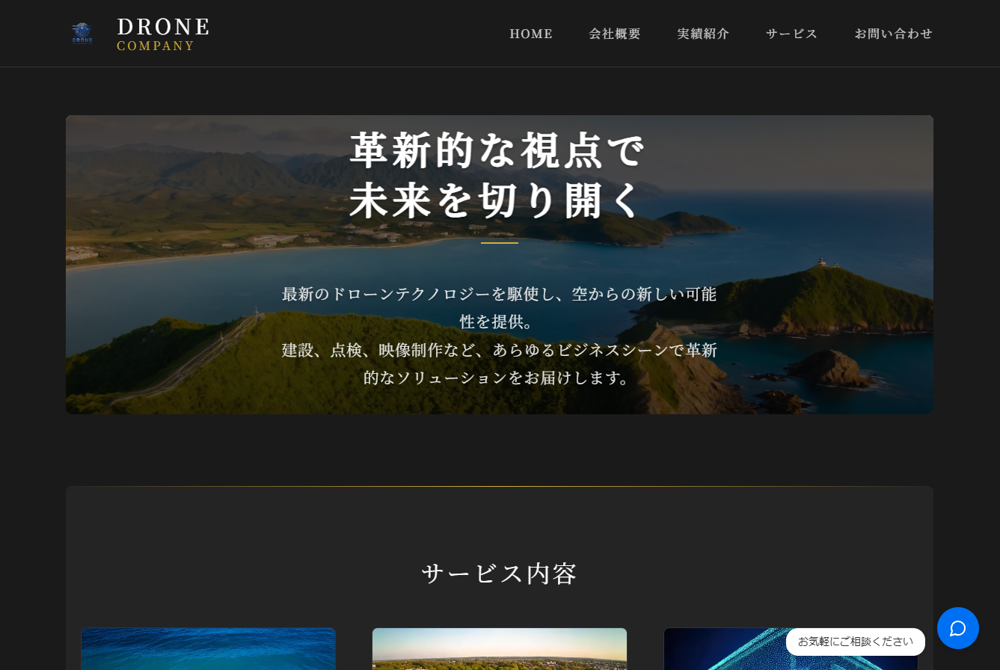
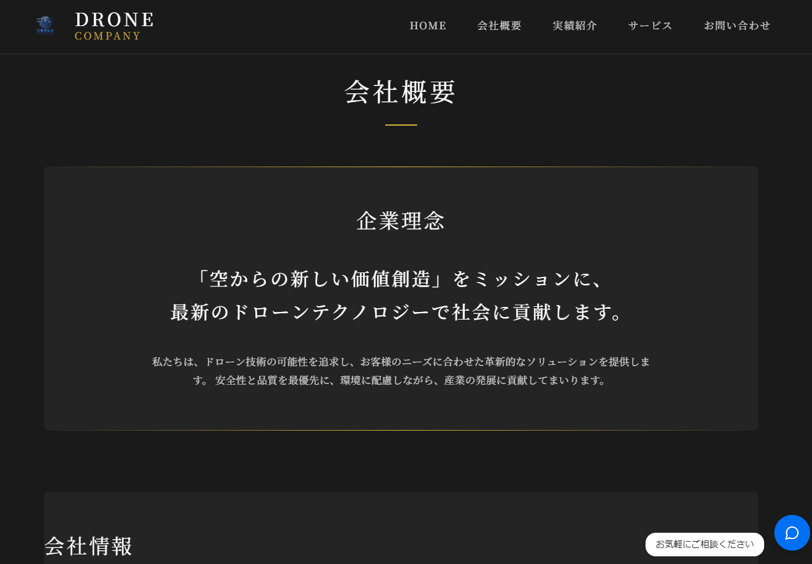
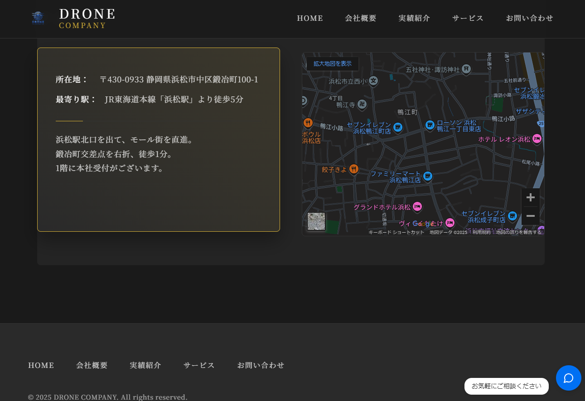
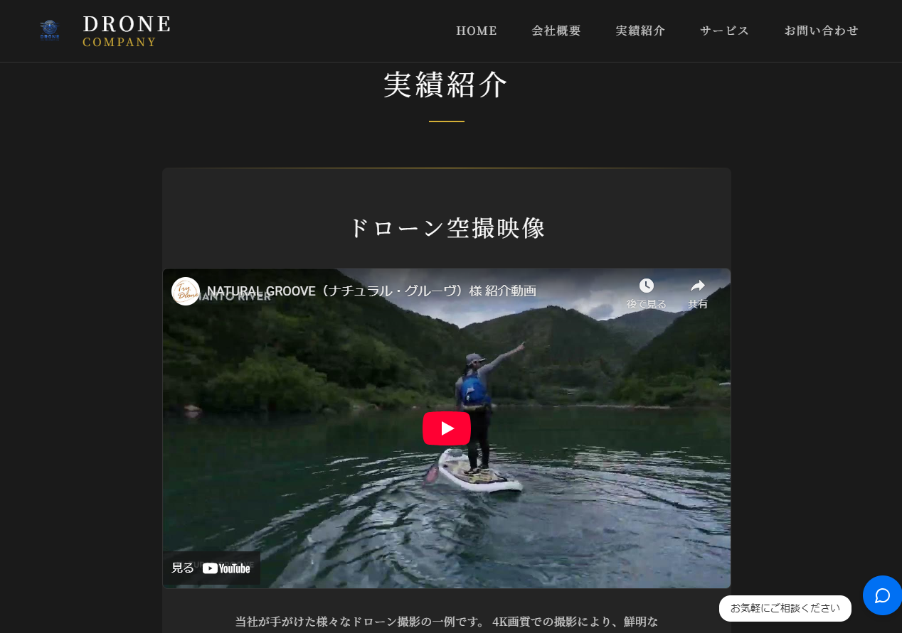
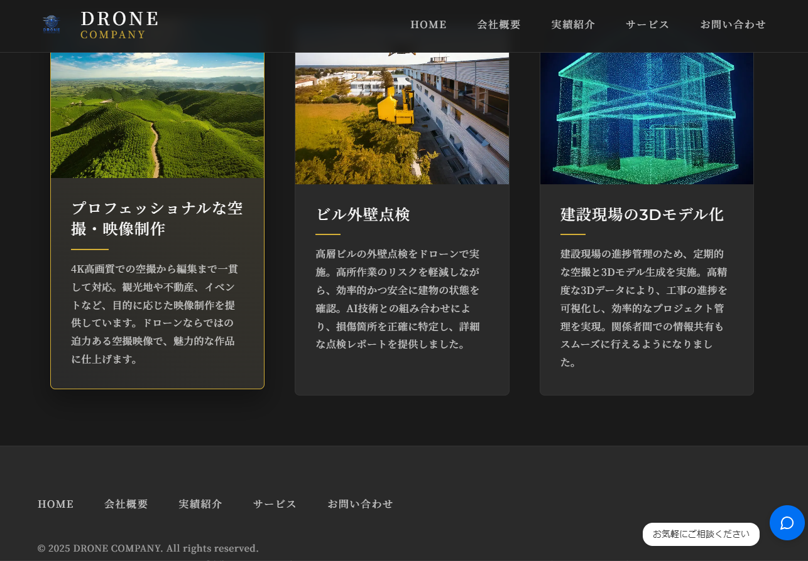
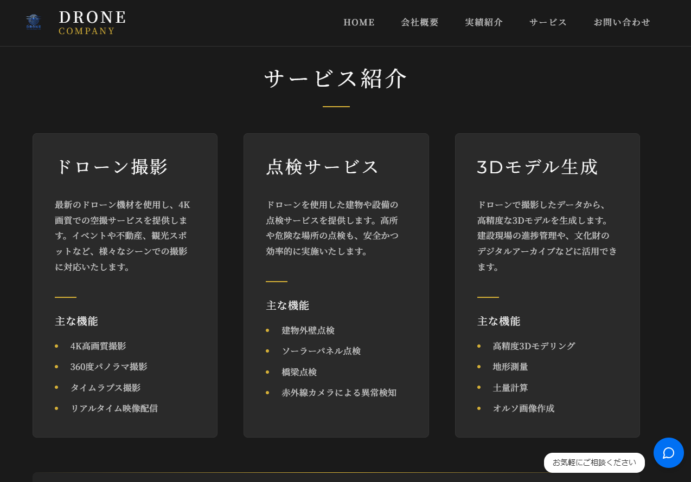
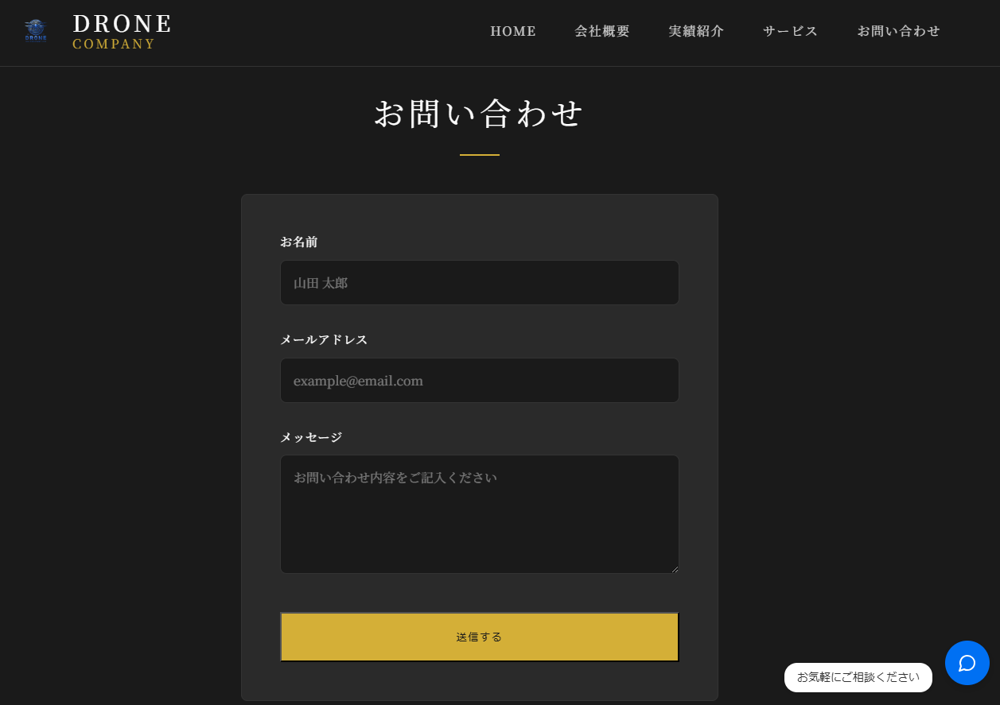

# ドローンサービス LP & AI チャットボット 🚁

[](https://nextjs.org/)
[](https://openai.com/)
[](https://supabase.com/)
[](https://ui.shadcn.com/)

## 📝 プロジェクト概要 | Overview

ドローンサービス会社のランディングページと、AI を活用したカスタマーサポートチャットボットを統合した Web アプリケーションです。

**デモサイト:** [portfolio-lp-a545-58yangs-projects.vercel.app](https://portfolio-lp-a545-58yangs-projects.vercel.app/)

This is a web application that integrates a drone service company's landing page with an AI-powered customer support chatbot.

### 🌟 主な機能 | Key Features

- **モダンな LP 設計** | Modern Landing Page Design

  - レスポンシブデザイン | Responsive design
  - アニメーション効果 | Smooth animations
  - 最適化された画像表示 | Optimized image loading

- **AI チャットボット** | AI Chatbot
  - OpenAI Assistants API を活用 | Powered by OpenAI Assistants API
  - ドローンサービスに特化した応答 | Specialized in drone service inquiries
  - チャット履歴の保存 | Chat history preservation

## 🛠️ 技術スタック | Tech Stack

- **フロントエンド | Frontend**

  - Next.js 14.1.0
  - React
  - shadcn/ui (UI コンポーネント)

- **バックエンド | Backend**

  - OpenAI Assistants API
  - Supabase (チャット履歴管理)

- **デプロイ | Deployment**
  - Vercel

## 💻 ローカル開発環境構築 | Local Development

```bash
# リポジトリのクローン | Clone the repository
git clone https://github.com/58yang/portfolio-lp.git
cd portfolio-lp

# 依存関係のインストール | Install dependencies
npm install

# 環境変数の設定 | Set up environment variables
cp .env.example .env.local
# .env.localファイルを編集し、必要な環境変数を設定
# Edit .env.local and set required environment variables

# 開発サーバーの起動 | Start development server
npm run dev
```

### 🔑 必要な環境変数 | Required Environment Variables

```env
OPENAI_API_KEY=your_openai_api_key
NEXT_PUBLIC_ENABLE_CHATBOT=true
NEXT_PUBLIC_SUPABASE_URL=your_supabase_url
NEXT_PUBLIC_SUPABASE_ANON_KEY=your_supabase_anon_key
```

## 📚 主要機能の実装について | Implementation Details

### AI チャットボット | AI Chatbot

- OpenAI Assistants API を使用したカスタム AI アシスタントの実装
- チャット履歴の Supabase での永続化
- リアルタイムのタイピングインジケーター
- エラーハンドリングとリトライメカニズム

### UI/UX デザイン | UI/UX Design

- Tailwind CSS と shadcn/ui を組み合わせたモダンなデザイン
- Framer Motion によるスムーズなアニメーション
- レスポンシブデザインの完全対応

## 🌐 デプロイ | Deployment

このプロジェクトは Vercel にデプロイすることを推奨します。

```bash
# Vercelへのデプロイ | Deploy to Vercel
vercel
```

## 📈 今後の展望 | Future Improvements

- [ ] 多言語対応の実装
- [ ] チャットボットの機能拡張（画像認識等）
- [ ] 予約システムの統合
- [ ] パフォーマンスの最適化

## 👨‍💻 作者 | Author

58yang

- GitHub: [@58yang](https://github.com/58yang)
- Repository: [portfolio-lp](https://github.com/58yang/portfolio-lp)

## 📄 ライセンス | License

This project is licensed under the MIT License - see the [LICENSE](LICENSE) file for details.

## 📸 スクリーンショット | Screenshots

### 🏠 トップページ | Home



### 🏢 会社概要 | About




### 📊 実績紹介 | Works




### 🛠️ サービス | Services



### 📞 お問い合わせ | Contact



### 💬 AI チャットボット | AI Chatbot


